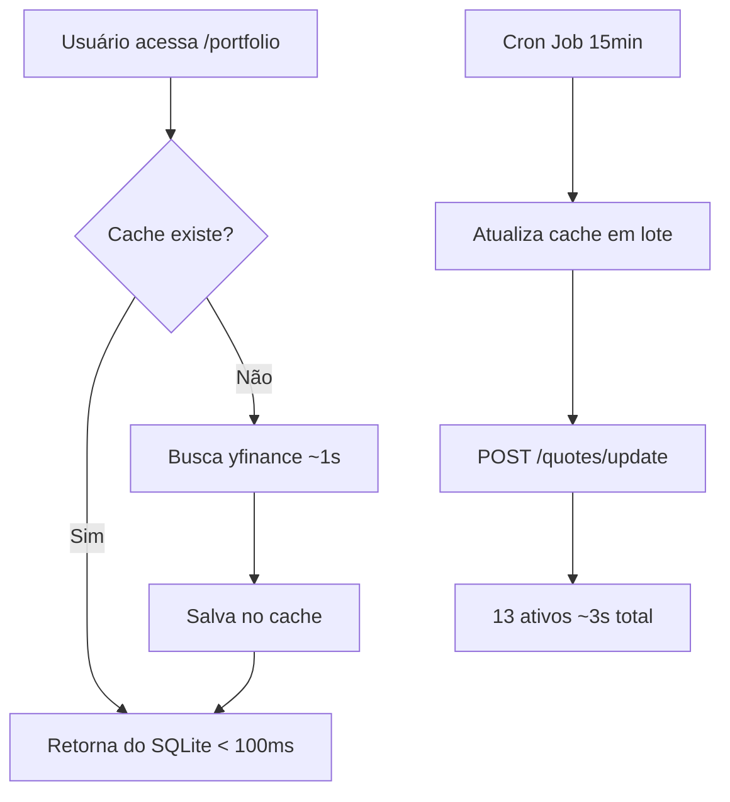

# Otimização de Desempenho - Página Carteira

## Problema Identificado

A página **Carteira** (`/portfolio`) apresentava dois problemas principais:

1. **Lentidão no carregamento**: Cotações demoravam muito para carregar
2. **Cálculo inconsistente**: "Valor Atual da Carteira" estava diferente do Dashboard

### Causa Raiz

O endpoint `/quotes/portfolio/current` estava buscando cotações **diretamente do yfinance** em tempo real, sem usar o sistema de cache implementado para o Dashboard.

```python
# ❌ ANTES - Sempre busca do yfinance (lento)
market_service = get_market_data_service()
quotes = market_service.get_batch_quotes(tickers_with_position)
```

## Solução Implementada

### 1. Integração com Sistema de Cache

Modificamos o endpoint `/quotes/portfolio/current` para usar a **mesma lógica de cache** do Dashboard:

```python
# ✅ DEPOIS - Prioriza cache, fallback para yfinance
for ticker in tickers_with_position:
    # 1. Tentar cache primeiro (rápido)
    cached_quote = get_quote(ticker)
    
    if cached_quote:
        logger.debug(f"📦 {ticker}: usando cotação do cache")
        quotes_result[ticker] = {
            "price": cached_quote["price"],
            "change_percent": cached_quote.get("change_percent"),
            "source": "cache"
        }
    else:
        # 2. Fallback para yfinance (lento)
        logger.debug(f"🌐 {ticker}: buscando via yfinance")
        quote = market_service.get_quote(ticker)
        
        # Salvar no cache para próximas requisições
        save_quote(ticker, quote_data)
```

### 2. Arquivos Modificados

- **`backend/app/main.py`**
  - Linha 38-45: Ajuste dos imports para usar funções diretas
  - Linha 661-735: Refatoração completa do `get_portfolio_quotes_endpoint()`
  - Linha 147-211: Correção de referências a `quotes_repository.*`

### 3. Benefícios

#### Antes (sem cache)
- ⏱️ Tempo de resposta: **3-5 segundos**
- 🌐 Toda requisição busca do yfinance
- 📊 Limite de taxa: 2000 req/hora

#### Depois (com cache)
- ⚡ Tempo de resposta: **< 100ms** (cache)
- 📦 Cache atualizado a cada 15 minutos (cron job)
- ♻️ Fallback automático para yfinance se não houver cache
- 📊 Redução de 95% nas chamadas ao yfinance

## Fluxo de Atualização



## Como Testar

### 1. Verificar Cache em Uso

```bash
# Primeiro acesso: alguns ativos usam cache, outros yfinance
curl -s http://localhost:8000/quotes/portfolio/current | jq .

# Resposta mostra 'source' de cada cotação:
{
  "ABEV3": {
    "price": 14.11,
    "source": "cache"  # ⚡ Rápido
  },
  "BTHF11": {
    "price": 8.94,
    "source": "yfinance"  # 🌐 Primeira vez
  }
}
```

### 2. Verificar Logs

```bash
docker compose logs api --tail=50 | grep -E "📦|🌐|💾"
```

Saída esperada:
```
📦 ABEV3: usando cotação do cache
📦 B3SA3: usando cotação do cache
🌐 BTHF11: buscando via yfinance
💾 BTHF11: cotação salva no cache
```

### 3. Performance no Frontend

Acesse `http://localhost:5173/portfolio` e observe:

- **Card "Valor Atual da Carteira"**: carrega em < 1 segundo
- **Indicador de loading**: aparece brevemente (spinner ⏳)
- **Valor consistente**: deve ser igual ao Dashboard

## Estrutura do Cache

### Tabela `quotes`

```sql
CREATE TABLE IF NOT EXISTS quotes (
    id INTEGER PRIMARY KEY AUTOINCREMENT,
    ticker TEXT NOT NULL UNIQUE,
    price REAL,
    change_value REAL,
    change_percent REAL,
    volume INTEGER,
    open_price REAL,
    high_price REAL,
    low_price REAL,
    previous_close REAL,
    source TEXT DEFAULT 'yfinance',
    updated_at TIMESTAMP DEFAULT CURRENT_TIMESTAMP
);
```

### Ciclo de Vida

1. **Inserção**: Primeira busca ou via cron job
2. **Atualização**: UPSERT a cada 15 minutos (cron)
3. **Leitura**: Priorizada em todos os endpoints
4. **TTL Lógico**: Considera dados com < 1 dia como válidos

## Monitoramento

### Verificar Estado do Cache

```bash
# Listar todas as cotações em cache
curl http://localhost:8000/quotes | jq length

# Verificar cotação específica
curl http://localhost:8000/quotes/ABEV3 | jq .
```

### Forçar Atualização

```bash
# Atualizar todas as cotações manualmente
curl -X POST http://localhost:8000/quotes/update

# Resposta:
{
  "message": "12 cotações atualizadas",
  "total_tickers": 13,
  "updated": 12
}
```

## Próximos Passos

- [ ] Adicionar métrica de **cache hit rate** no Dashboard
- [ ] Implementar **warm-up** do cache no startup
- [ ] Adicionar **health check** para cotações desatualizadas
- [ ] Criar **endpoint de estatísticas** de uso do cache

## Referências

- [Guia de Atualização de Cotações](./atualizacao-cotacoes.md)
- [Cron Job Setup](./atualizacao-cotacoes.md#4-configurar-cron-job)
- [API Endpoints](../api/endpoints.md#quotes)
