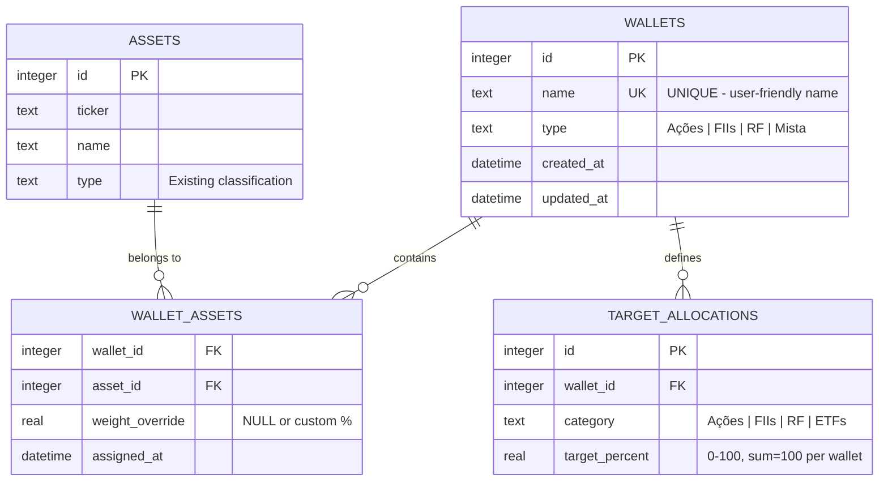
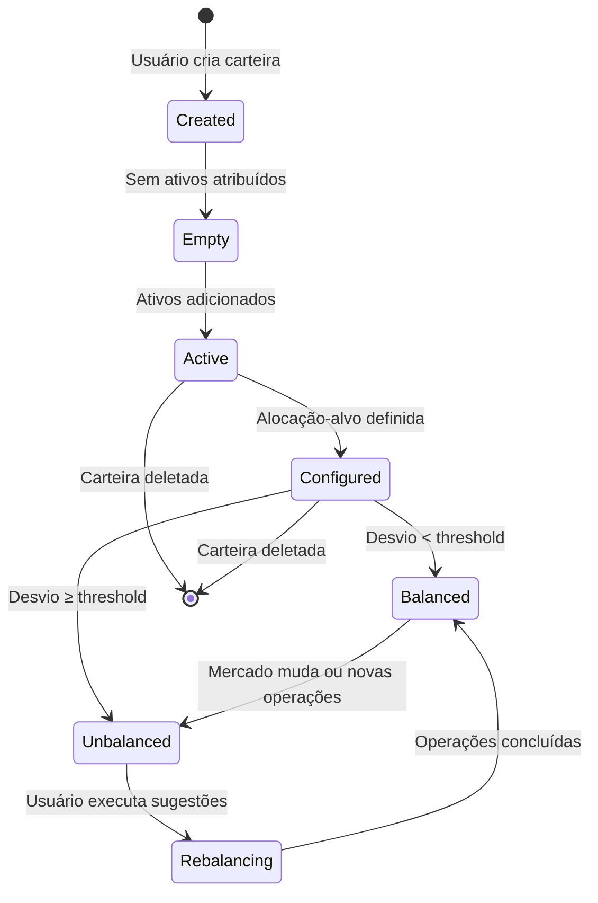

# Data Model: Recomendações de Rebalanceamento de Carteiras

**Feature**: 001-wallet-rebalancing-recommendations  
**Date**: 2026-02-22  
**Status**: Complete

## Entity Relationship Diagram



## Database Schema

### Table: `wallets`

Armazena metadados de carteiras. Valores financeiros são **sempre calculados** (principle IV).

```sql
CREATE TABLE IF NOT EXISTS wallets (
    id INTEGER PRIMARY KEY AUTOINCREMENT,
    name TEXT NOT NULL UNIQUE,  -- "Aposentadoria", "Dividendos", etc.
    type TEXT NOT NULL CHECK(type IN ('Ações', 'FIIs', 'RF', 'Mista')),
    created_at DATETIME DEFAULT CURRENT_TIMESTAMP,
    updated_at DATETIME DEFAULT CURRENT_TIMESTAMP
);

CREATE INDEX idx_wallets_name ON wallets(name);
```

**Validation Rules**:
- `name`: 3-50 caracteres, alfanumérico + espaços
- `type`: Enum restrito, não pode ser NULL
- UNIQUE em `name` garante idempotência (principle II)

---

### Table: `wallet_assets`

Relacionamento N:M entre carteiras e ativos. Um ativo pode estar em múltiplas carteiras.

```sql
CREATE TABLE IF NOT EXISTS wallet_assets (
    wallet_id INTEGER NOT NULL,
    asset_id INTEGER NOT NULL,
    weight_override REAL NULL CHECK(weight_override >= 0 AND weight_override <= 100),
    assigned_at DATETIME DEFAULT CURRENT_TIMESTAMP,
    PRIMARY KEY (wallet_id, asset_id),
    FOREIGN KEY (wallet_id) REFERENCES wallets(id) ON DELETE CASCADE,
    FOREIGN KEY (asset_id) REFERENCES assets(id) ON DELETE CASCADE
);

CREATE INDEX idx_wallet_assets_wallet ON wallet_assets(wallet_id);
CREATE INDEX idx_wallet_assets_asset ON wallet_assets(asset_id);
```

**Fields**:
- `wallet_id`, `asset_id`: Composite PK, garante unicidade
- `weight_override`: Opcional - permite customizar peso de ativo específico (ex: "PETR4 deve ser 30% desta carteira independente da categoria")
- `assigned_at`: Auditoria

**Cascade Behavior**: DELETE CASCADE - se carteira deletada, atribuições removidas automaticamente

---

### Table: `target_allocations`

Define alocação-alvo percentual por categoria dentro de uma carteira.

```sql
CREATE TABLE IF NOT EXISTS target_allocations (
    id INTEGER PRIMARY KEY AUTOINCREMENT,
    wallet_id INTEGER NOT NULL,
    category TEXT NOT NULL CHECK(category IN ('Ações', 'FIIs', 'RF', 'ETFs', 'Outros')),
    target_percent REAL NOT NULL CHECK(target_percent >= 0 AND target_percent <= 100),
    FOREIGN KEY (wallet_id) REFERENCES wallets(id) ON DELETE CASCADE,
    UNIQUE(wallet_id, category)
);

CREATE INDEX idx_target_allocations_wallet ON target_allocations(wallet_id);
```

**Validation Rules**:
- `target_percent`: 0-100 por categoria
- **Application-level validation**: `SUM(target_percent) = 100` por `wallet_id`
- UNIQUE(wallet_id, category): Apenas uma alocação-alvo por categoria por carteira

---

## Calculated Entities (Not Persisted)

### `WalletSummary` (Computed View)

Estrutura retornada pela API para listagem de carteiras:

```typescript
interface WalletSummary {
  id: number;
  name: string;
  type: 'Ações' | 'FIIs' | 'RF' | 'Mista';
  total_value: number;        // Calculado: sum(asset qty * current price)
  cost_basis: number;         // Calculado: sum(operations cost)
  profitability: number;      // (total_value - cost_basis) / cost_basis * 100
  num_assets: number;         // count(distinct asset_id)
  last_updated: string;       // Timestamp última cotação
  is_balanced: boolean;       // All deviations < threshold
}
```

**Source**: JOIN `wallet_assets` → `operations` → `quotes` + cálculos em `wallet_calculator.py`

---

### `WalletAllocation` (Computed View)

Alocação atual vs alvo por categoria:

```typescript
interface CategoryAllocation {
  category: string;           // 'Ações', 'FIIs', etc.
  current_value: number;      // R$ atual nessa categoria
  current_percent: number;    // % do total da carteira
  target_percent: number | null;  // NULL se não definido
  deviation: number | null;   // current - target (em pontos percentuais)
  assets: AssetPosition[];    // Lista de ativos nessa categoria
}

interface WalletAllocation {
  wallet_id: number;
  categories: CategoryAllocation[];
  total_value: number;
}
```

**Source**: GROUP BY category em query + join com `target_allocations`

---

### `RebalancingRecommendation` (Computed Output)

Sugestões de rebalanceamento - **NUNCA persistido**:

```typescript
interface RebalancingSuggestion {
  ticker: string;
  action: 'Comprar' | 'Vender' | 'Aportar';  // "Aportar" para RF
  quantity: number;
  estimated_price: number;
  estimated_value: number;
  reason: string;  // Ex: "Categoria Ações está 15% acima do alvo"
}

interface RebalancingRecommendation {
  wallet_id: number;
  generated_at: string;
  suggestions: RebalancingSuggestion[];
  estimated_costs: {
    brokerage_fees: number;
    taxes: number;
    total: number;
  };
  net_benefit: number;  // Benefício - custos
  is_recommended: boolean;  // false se custos > benefício
  summary: string;  // Texto explicativo para usuário
}
```

**Source**: `rebalancing_engine.py` - algoritmo threshold-based

---

## State Transitions

### Wallet Lifecycle



**Trigger Events**:
- Criação/Deleção: User action via UI
- Empty → Active: Atribuição de ativo
- Active → Configured: Definição de target_allocations
- Balanced ↔ Unbalanced: Recalculado a cada pageview ou cotação atualizada

---

## Queries Essenciais

### 1. Listar carteiras do usuário com métricas

```sql
SELECT 
    w.id, w.name, w.type,
    COUNT(DISTINCT wa.asset_id) as num_assets,
    COALESCE(SUM(p.current_value), 0) as total_value,
    COALESCE(SUM(p.cost_basis), 0) as cost_basis
FROM wallets w
LEFT JOIN wallet_assets wa ON w.id = wa.wallet_id
LEFT JOIN (
    -- Subquery calcula posição atual por ativo
    SELECT asset_id, 
           SUM(CASE WHEN movement_type='COMPRA' THEN quantity ELSE -quantity END) as qty,
           SUM(CASE WHEN movement_type='COMPRA' THEN quantity*price ELSE 0 END) as cost_basis
    FROM operations
    GROUP BY asset_id
) p ON wa.asset_id = p.asset_id
GROUP BY w.id;
```

### 2. Alocação atual vs alvo

```sql
SELECT 
    a.type as category,
    SUM(pos.qty * q.current_price) as current_value,
    ta.target_percent
FROM wallet_assets wa
JOIN assets a ON wa.asset_id = a.id
JOIN (SELECT asset_id, SUM(...) as qty FROM operations GROUP BY asset_id) pos 
    ON a.id = pos.asset_id
LEFT JOIN quotes q ON a.ticker = q.ticker
LEFT JOIN target_allocations ta ON wa.wallet_id = ta.wallet_id AND a.type = ta.category
WHERE wa.wallet_id = ?
GROUP BY a.type;
```

---

## Migration Script

```sql
-- migration_add_wallets.sql
BEGIN TRANSACTION;

-- Criar tabelas
CREATE TABLE IF NOT EXISTS wallets (...);
CREATE TABLE IF NOT EXISTS wallet_assets (...);
CREATE TABLE IF NOT EXISTS target_allocations (...);

-- Criar índices
CREATE INDEX idx_wallets_name ON wallets(name);
CREATE INDEX idx_wallet_assets_wallet ON wallet_assets(wallet_id);
CREATE INDEX idx_wallet_assets_asset ON wallet_assets(asset_id);
CREATE INDEX idx_target_allocations_wallet ON target_allocations(wallet_id);

-- Inserir carteira padrão para usuários existentes
INSERT OR IGNORE INTO wallets (name, type) 
VALUES ('Principal', 'Mista');

-- Atribuir todos ativos existentes à carteira padrão
INSERT OR IGNORE INTO wallet_assets (wallet_id, asset_id)
SELECT 1, id FROM assets;

COMMIT;
```

**Rollback Strategy**: DROP TABLE IF EXISTS para cada tabela em ordem reversa (target_allocations → wallet_assets → wallets)

---

**Status**: ✅ Data Model Complete - Ready for Contracts
