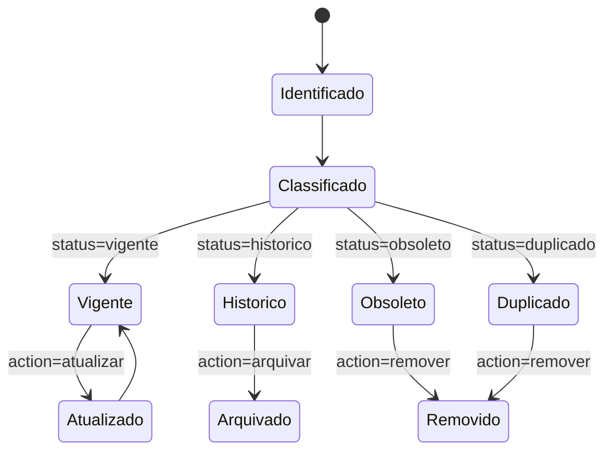

# Data Model: Limpeza da Documentação

**Feature**: 002-docs-limpeza-atualizada  
**Date**: 2026-02-28  
**Status**: Complete

## Entities

### 1. `DocumentationFile`

Representa um arquivo de documentação identificado no inventário.

**Campos**:
- `path` (string, PK lógico): caminho relativo do arquivo.
- `title` (string): título principal extraído.
- `domain` (enum): `arquitetura`, `api`, `guia`, `setup`, `status`, `outro`.
- `status` (enum): `vigente`, `historico`, `obsoleto`, `duplicado`.
- `owner` (string|null): responsável pelo domínio.
- `last_review_date` (date|null): data da última revisão válida.
- `action` (enum): `manter`, `atualizar`, `arquivar`, `remover`.
- `rationale` (string): justificativa da decisão.

**Regras de validação**:
- `status = vigente` exige `action = manter` ou `atualizar`.
- `status = historico` exige `action = arquivar`.
- `status = obsoleto` ou `duplicado` exige `action = remover` ou `arquivar`.
- `rationale` obrigatório para qualquer `action` diferente de `manter`.

---

### 2. `CanonicalTopic`

Representa um tópico de documentação que deve ter única fonte oficial.

**Campos**:
- `topic_id` (string, PK): identificador do tópico.
- `topic_name` (string): nome amigável.
- `canonical_path` (string): arquivo oficial do tópico.
- `aliases` (string[]): documentos relacionados/deprecados.
- `navigation_entries` (string[]): índices onde o tópico aparece.

**Regras de validação**:
- Um único `canonical_path` por `topic_id`.
- `canonical_path` deve existir após a limpeza.
- Todos os `aliases` devem ter ação `arquivar` ou `remover` com nota de migração.

---

### 3. `GovernanceRule`

Representa regra operacional para manter documentação atualizada no tempo.

**Campos**:
- `rule_id` (string, PK)
- `description` (string)
- `trigger` (enum): `pr_change`, `quarterly_review`, `release`
- `required_checks` (string[]): validações obrigatórias.
- `owner_role` (string): papel responsável.

**Regras de validação**:
- Toda regra deve ter ao menos um `required_checks`.
- Regras com trigger `pr_change` devem incluir checagem de links e atualização de índice quando aplicável.

## Relationships

- `CanonicalTopic` 1:N `DocumentationFile` (1 canônico + N aliases por tópico).
- `GovernanceRule` N:N `CanonicalTopic` (uma regra pode afetar vários tópicos e vice-versa).

## State Transitions

## Derived Views

### `DocumentationInventorySummary` (derivado)

- `total_files`
- `vigentes`
- `historicos`
- `obsoletos`
- `duplicados`
- `pending_actions`

### `NavigationHealth` (derivado)

- `broken_links_count`
- `orphan_docs_count` (documentos sem referência de navegação)
- `canonical_coverage_percent` (tópicos com fonte canônica definida)

## Scope Note

Este modelo é conceitual para orientar implementação e governança documental. Não implica criação obrigatória de nova tabela no banco do produto.
